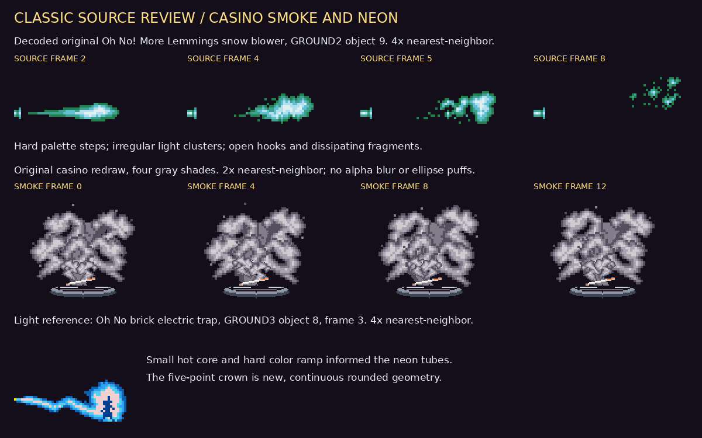
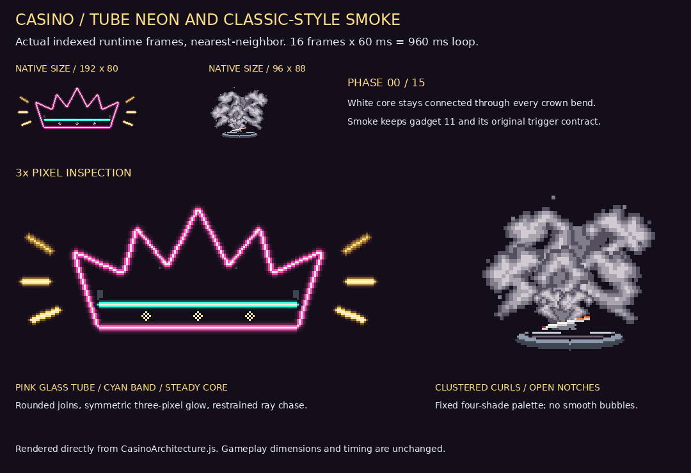

# Casino neon and smoke art review

The crown and cigarette smoke were redrawn after inspecting decoded original
Lemmings object artwork. The other eight casino architecture assets are
pixel-identical to commit `38a80f8f`.

## Source inspection

All 97 nonempty object sprites across the original five Lemmings groundsets and
four Oh No! More Lemmings groundsets were decoded with the repository's
`NodeFileProvider`, `FileContainer` and `GroundReader`, then visually reviewed.
The most useful atmospheric reference is the Oh No snow blower, not a literal
cigarette-smoke sprite:

- `lemmings_ohNo/GROUND2O.DAT` and `VGAGR2.DAT`, object 9, 64 × 23, 11 frames.
  Frames 2, 4, 5 and 8 show a compact plume opening into irregular hooked
  clusters and small dissipating fragments. Five hard indexed shades provide
  the volume. There is no alpha blur or smooth shaded bubble construction.
- `lemmings_ohNo/GROUND3O.DAT` and `VGAGR3.DAT`, object 8, 48 × 36, 14 frames.
  The electric arc's compact bright core and narrow stepped palette ramp
  informed the crown's light treatment. The crown geometry is newly drawn.

The source artwork is shown for comparison only. The casino runtime does not
read these DAT files or copy their frame buffers.



## Redraw

Smoke uses three original hand-clustered, asymmetric curl stencils with four
fixed gray shades. Open notches, uneven highlights and thin fragments interrupt
the outer contour; interlocking plumes keep the cloud dense. Periodic row sway
and two-pixel lift make the sixteen-frame loop continuous. The cigarette and
ashtray remain readable below the smoke. The ashtray alone uses ellipses.

The neon crown has a recognizable five-point outline, rounded tube bends,
one uninterrupted pale core, a bright pink glass edge and two darker one-pixel
glow steps. Full-path painting passes prevent later segments from covering
previous core pixels. A cyan crossbar and three small gold inlays form the
band. The crown itself stays steadily lit; only the six outer rays chase.



[Native-rate sixteen-frame loop](previews/casino-neon-smoke-animation.gif)

## Preserved contracts and verification

- Crown: 192 × 80, sixteen indexed frames, existing piece ID and placement.
- Smoke: 96 × 88, sixteen indexed frames, gadget 11, `FRYING`,
  `characterHazard: 'smoke'`, fixed trigger `{x: 7, y: 12, width: 82, height: 66}`.
- Transparency remains palette index 128; no runtime image/filter dependency.
- The GIF uses the normal game clock's 60 ms tick, one object frame per tick,
  for a 960 ms loop. The static proof includes native-size and 3× views.
- 22 focused tests passed across `casino-spectacle`, `decoration-packs`,
  `editor/neon-cabaret-runtime` and `neon-cabaret-pack`.
- New regressions check connected crown cores, symmetric glow, steady crown
  pixels, deterministic smoke, all four smoke shades and a bounded loop seam.
- Repository format, lint, undefined-call scan and critical typecheck passed.

Rebuild all three review artifacts from current runtime pixels:

```sh
python tools/exportCasinoNeonSmokeProof.py
```

The proof tool uses existing Node dependencies and Pillow, without a browser.
It decodes the original reference sprites on each run and exports current
runtime frames, so the comparison does not depend on a stale atlas.

### Reviewed binary identities (SHA-256)

- GROUND2O: `5f5e25e1566ff69c452cd25ecb5d4a0336972816b759ad13137491613c445a20`
- VGAGR2: `11703175849fa4ef4a825add3ce4bd748a88fac09d8d0cd919c2ae40b9aabbed`
- GROUND3O: `4ca95fb12914bf2889ea7c60b316b2975faeb4772c0489fe4ba2e7d317de99d8`
- VGAGR3: `0ca865820d868502b8a1da9c1a1a6e86e3d797e3bf6af33c568881b720f0ee1f`
