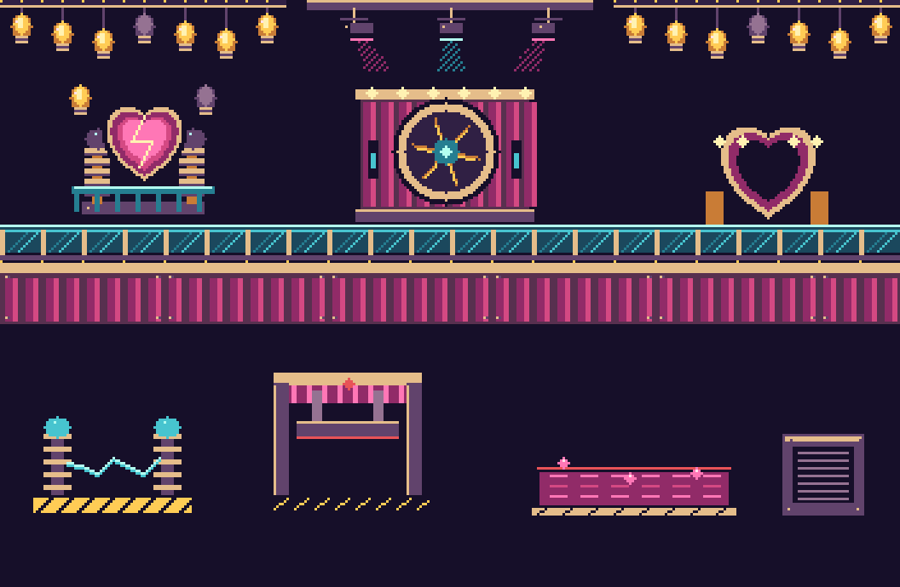
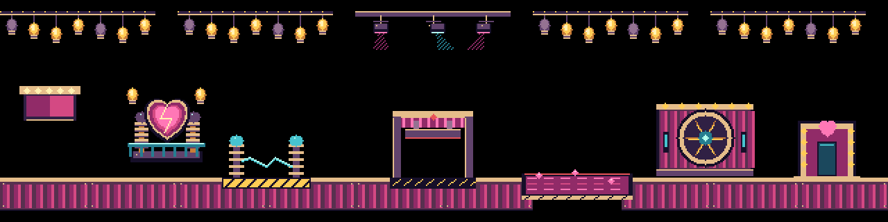

# Neon Cabaret Power Station

An original indexed-pixel theme: raspberry velvet, turquoise glass, champagne brass,
heart-shaped machinery, and generous incandescent footlights. All artwork is
code-native and deterministic; there are no fetched/generated raster dependencies,
fonts, vendor artwork, random animation states, or changes to actor physics.

## Delivered assets

- Six scenery pieces: bulb garland, dancing spotlight rail, heart transformer,
  velvet dynamo, glass catwalk fascia, footlight chase.
- Six terrain tiles: velvet foundation, glass slab, brass stairs, steel amplifier,
  connector column, hollow heart marquee arch.
- Three hazard-ready assets: live arc (FRYING), curtain press (TRAP), coolant bath
  (DROWN). Each has a fixed local trigger rectangle and visible danger markings.

## Play and author levels

Open `editor.html`, choose `neon-cabaret` in the Style selector, and place terrain,
entrance, exit, scenery or hazards from the normal palettes. Press Playtest to use
the ordinary game engine. No external graphics files or new actor physics are
required. The theme appears for every base game pack because its assets are built in.

For a complete starter puzzle, import
[Opening Night](../examples/neon-cabaret/opening-night.nxlv) through the editor's
level-file input, then Playtest. Save at least five of twenty performers. You have
builders and the usual skills to route around the live arc, curtain press and
coolant gap. The introductory floor gives room to plan the first bridge.

Save custom levels as `.nxlv`. Classic `.lvl` cannot embed the theme assets;
export emits an explicit custom-style warning rather than pretending portability.

`createNeonCabaretGroundSet()` adapts the original indexed assets to the existing
GroundRenderer and MapObject contracts. The live arc uses FRYING, the curtain
press uses TRAP (one-shot animation and normal 16-tick cooldown), and coolant uses
DROWN. Entrance ID 1 and exit ID 0 follow the existing engine convention. The
amplifier tile is protected steel, while the heart arch's interior stays empty.
Explicit `characterHazard` metadata identifies electric, crush and acid art for
compatible character death presentation without changing those action transitions.

`createNeonCabaretPack()` supplies the companion procgen decoration selector.
Select Neon Cabaret or use `decoration=neon-cabaret` once that shared decoration
integration is present. Procgen scenery remains noncolliding; live hazards are in
the playable editor theme, not silently mixed into endless-mode scenery.

## Preview and validation

Serve the repository with `npm start`, then open
`docs/previews/neon-cabaret.html`. It includes a composed stage, every animated
asset, terrain palette and hazard gallery. The gallery is art-only; use editor Playtest for operational hazards. Pause freezes all previews;
`prefers-reduced-motion` starts paused. The scene intentionally separates the
hazard gallery from decorative machinery, avoiding misleading lethal scenery.

Run `npx mocha test/neon-cabaret-pack.test.js test/editor/neon-cabaret-runtime.test.js` for determinism, dimensions,
transparency, palette indices, trigger bounds, scenery separation and storage.

All animated assets are baked into 16 indexed frames during catalog creation.
The full playable groundset, including entrance and exit, uses 491,200 bytes
(about 480 KiB) of raw indexed frame storage.
The palette has 20 entries, encoded ABGR for existing renderers; index 128 is
transparent. No raster generation is required during game rendering. The preview
caches RGBA canvases once. Main runtime rendering uses the shared decoration
renderer caches and culling rather than a per-actor draw loop.

## Art direction and semantics

Decoration lighting uses slow chase rhythms and short sweeps, never whole-screen
flashes. Turquoise glass edges define walkable material; bright opaque highlights
keep its collision silhouette legible. Brass step tops define each riser. Steel
is deliberately opaque, with a charcoal grille and corner rivets. Hazards use
red rims or yellow-black stripes in addition to color; the live arc always spans
the central dangerous opening. Decorative transformer coils sit behind a guard
rail and are visually distinct from the striped, exposed arc hazard.
